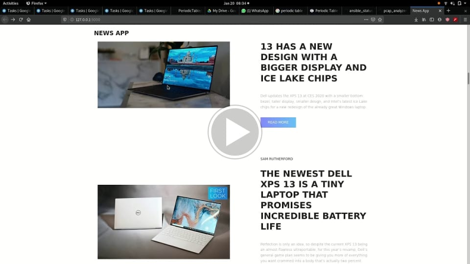

# NewsSite
A flask website to display the latest news  
  
# Usage
* Clone this repo and start a virualenv such that the directory looks like this :
```
NewsSite/
  venv/
  app/
    get_news.py
    news_site.py
    templates/
      index.html
      css/
        bootstrap.css
        main.css
```
* Run the python file named news_site.py
* Choose whether you want to sort by time published or popularity
* Open the link porvided
* Enjoy your news  
  
# Sample
[](https://drive.google.com/file/d/193whHcZ-kM8CRdfpvkwGE1F38gFxmQts/view?usp=sharing "News App sample")
